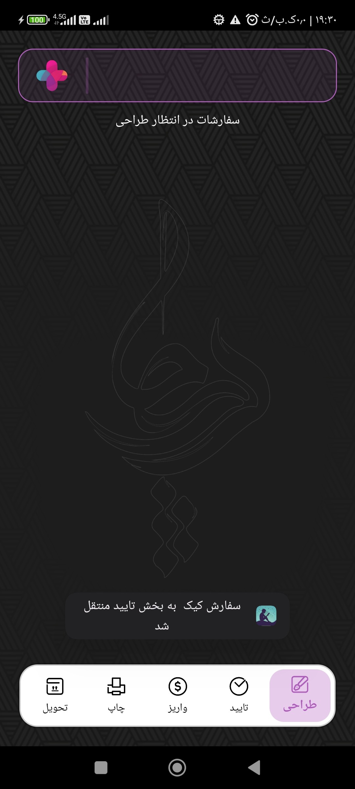
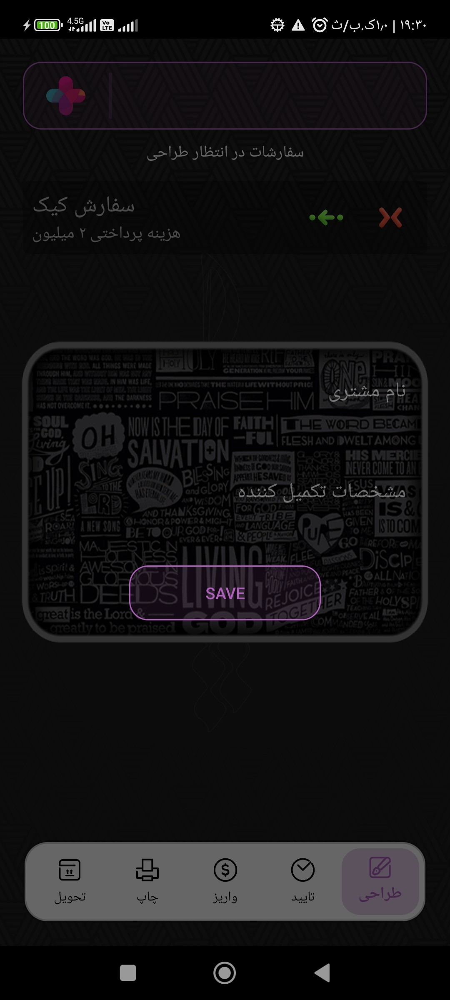
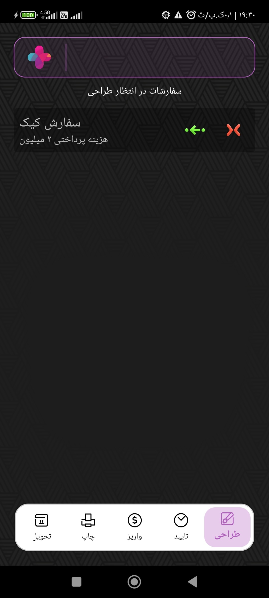

# اپلیکیشن مدیریت جریان سفارش 

یک اپلیکیشن اموزشی ساده برای مدیریت جریان سفارش که با **Kotlin** و    layoutهای XML نوشته شده.  
هدف اصلی این پروژه مدیریت لیستی از سفارشات هست که از shared Prefrences بعنوان پایگاه داده ی اپلیکیشن استفاده میکنه و با ترکیب RecyclerView و  Fragment به شکل اسپاکتی کد لیست رو مدیریت میکنه :

- مدیریت سفارش  ( ذخیره کردن هر سفارش در Shared prefrences و مدیریت فرایند بصورت دستی)
- کار با Xml widgets
.

## عملکرد برنامه
- عملیات اصلی : (عملیات اضافه کردن سفارش  ، حذف کردن سفارش ، انتقال سفارش به لیست بعدی ))
   

<table style="width:100%">
  <tr>
    <td></td> 
    <td></td> 
    <td></td> 
  </tr>

## تکنولوژی‌های استفاده شده
- زبان: **Kotlin**
- Shared Prefrences - RecyclerView - Fragment -  constraintlayout -  cardview - ObjectAnimator

- محیط توسعه: **Android Studio**
- minSdk = 24
  targetSdk = 34
  

#)
